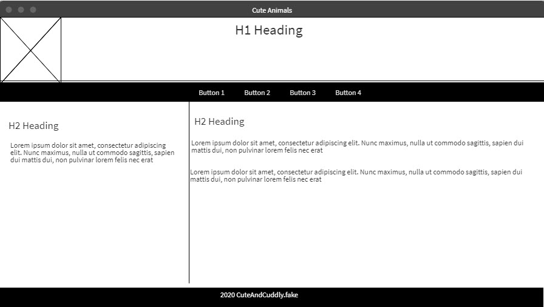

# About This Assignment

## Requirements

1. Create a webpage wireframe for a simple website. Your wireframe should include enough information to reflect what will appear on the home page of a website. Think about the general elements of most web pages: headers, footers, sidebars, and content areas.
2. Write the basic HTML code for the webpage wireframe you have created.
3. Create an external style sheet to format your simple Web page as follows:
   - Set the document background color to yellow
   - Set the document default font family list to Arial, Helvetica, Verdana, and sans-serif
   - Set the document default font size to 12px
   - h1 selector to be 2em in size with blue text color
   - Hyperlinks to have a background color of black, text color of white, and no text decoration

## Wireframe

