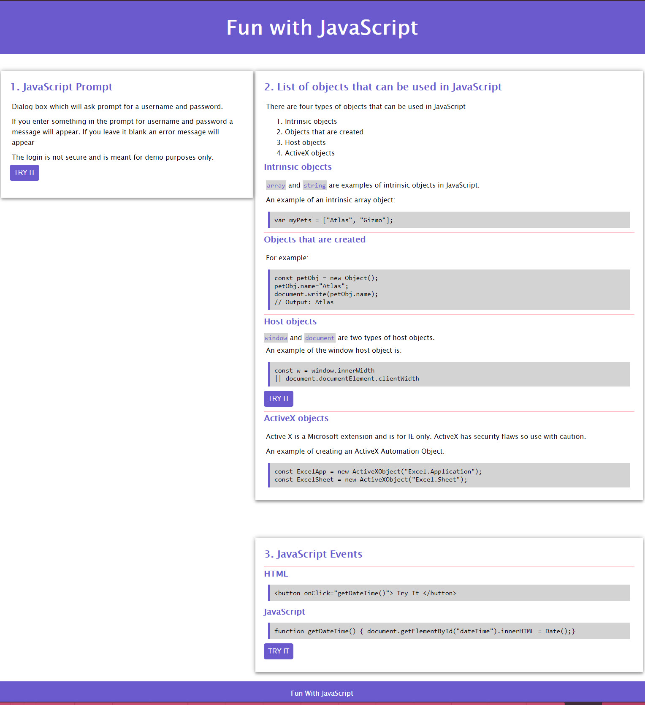

# About This Assignment

## Requirements

1. Write a script to prompt for a username and password.
2. Provide list of objects that can be used in Javascript and provide an example of each.
3. Choose a Javascript event and provide a code example

## Screenshots

### Page

### 1. Username and Password Prompt

### 2. List of Objects

### 3. JavaScript Event

