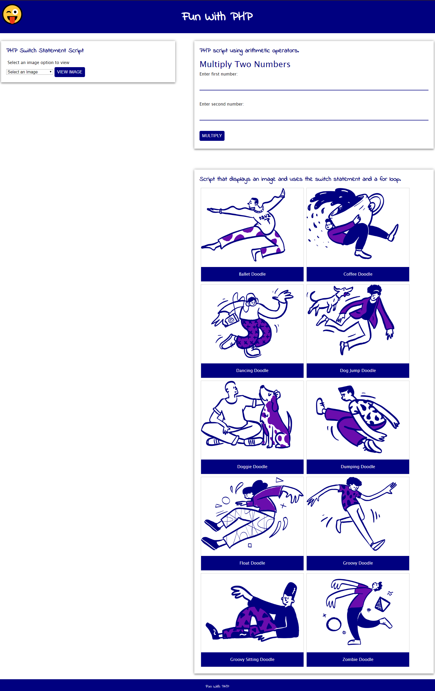
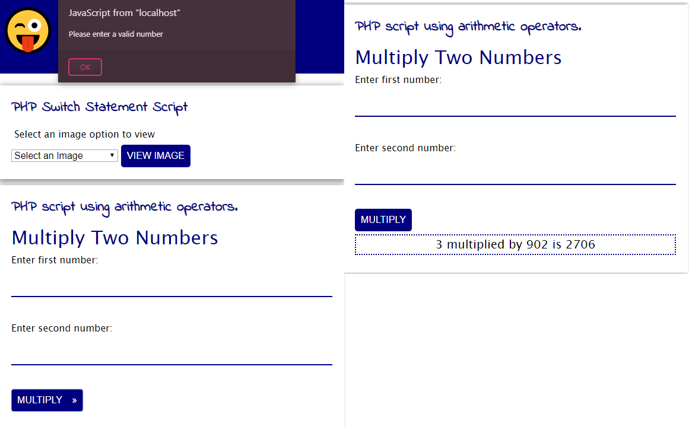
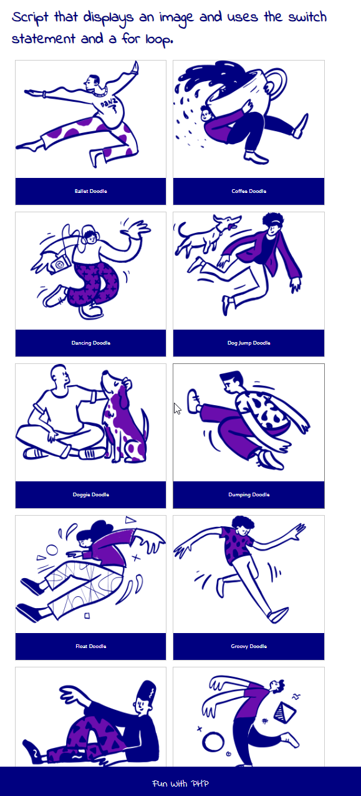
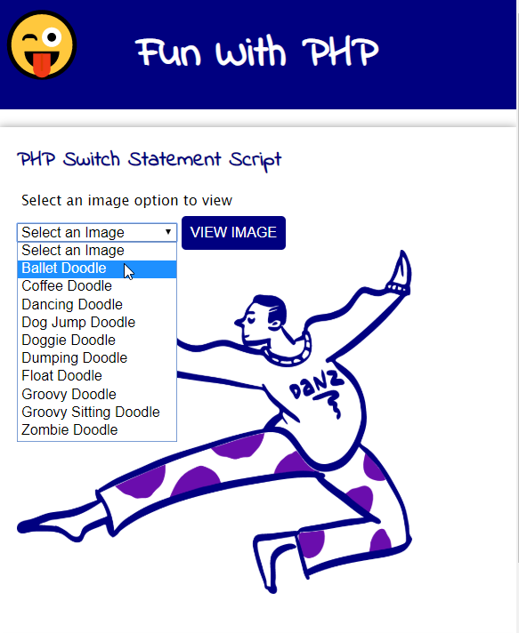

# About This Assignment

## Requirements

1. Write a PHP script. In your script use all of the following:
   - HTML
   - JavaScript
   - PHP
2. Create a script that displays an image and uses the switch statement and a for loop.
3. Write a PHP script using arithmetic operators.

## Screenshots

### Page

### Created using a PHP script using arithmetic operators

If invalid response is entered an alert will appear. The form is validated by JavaScript and checks for both empty input and invalid numbers (such as a letter).

### Created using script that displays an image and uses the switch statement and a for loop

### Created with a PHP script that uses switch

