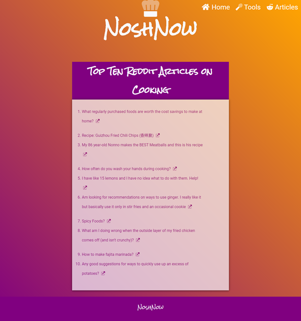

# About This Assignment

## Requirements

1. A diagram/wireframe of your web application showing all pages and interactions.
2. An application that functions in its implementation.
3. Written or recorded explanation of your application's purpose and attempted functionality as well as a description of how a user would interact with it.
   (This can be written or done as a video walkthrough.)

## View Site

[View Site](https://swdv-620-billiemj.codeanyapp.com/index.php)

## Wireframe

[View on LucidChart](https://www.lucidchart.com/documents/view/d42827af-3fe7-443d-9818-36f08947e2e0/0_0)

Note: Top links are clickable

## Home

- Javascript allows the user to search for recipes through the Edaman API.
- Only one result is returned for each search
- The results will display
  - the name of the site the recipe is from
  - the title of the recipe
  - an image of the recipe
  - an external link to the recipe

## Tools

- PHP script converts cups, tablespoons, teaspoons
- Handy conversion chart with highlight effect when hovering

## Articles

Reddit content loaded dynamically using JavaScript

